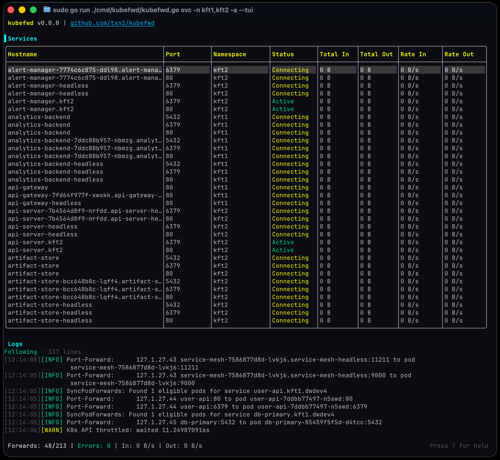
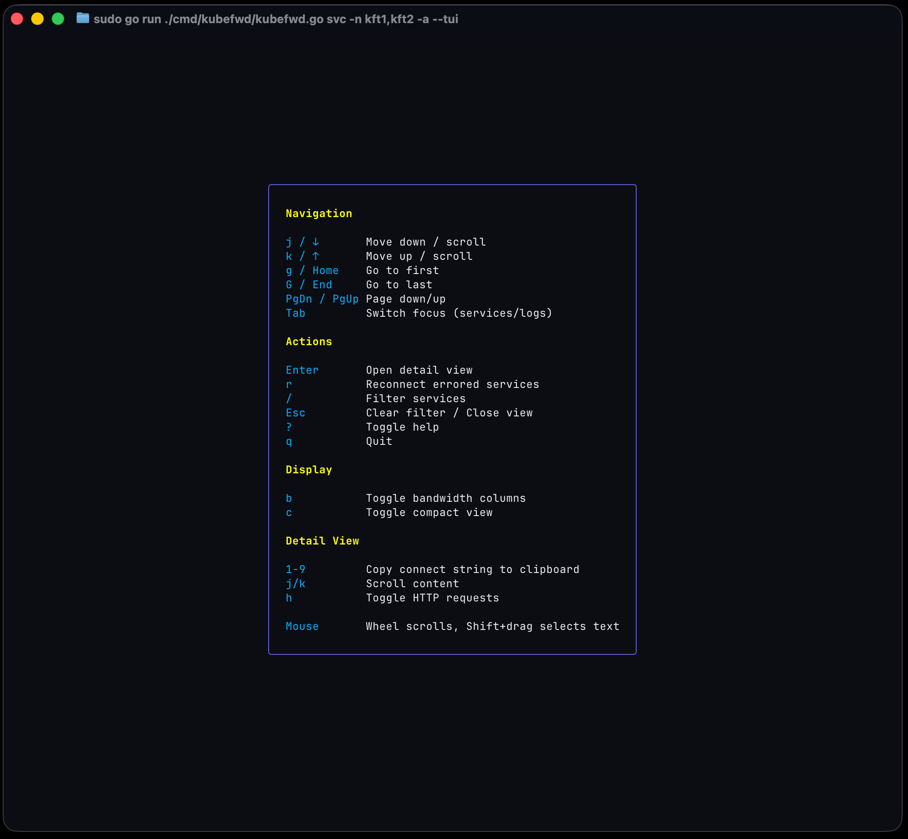
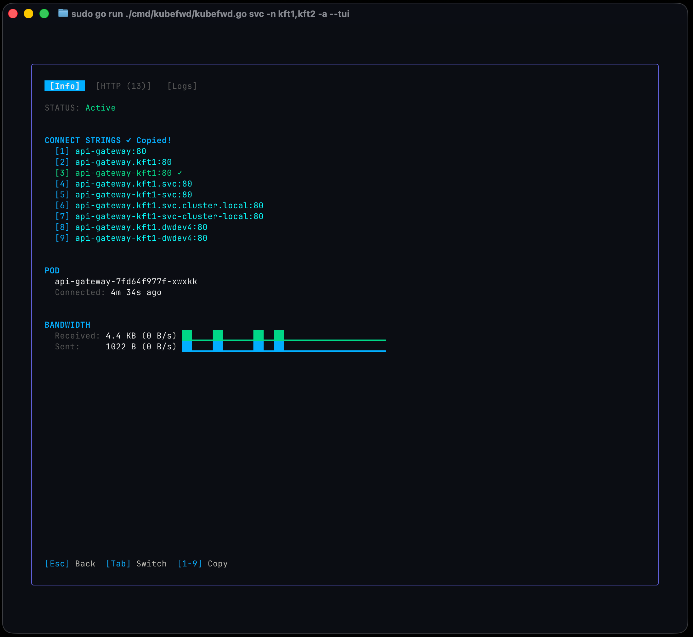
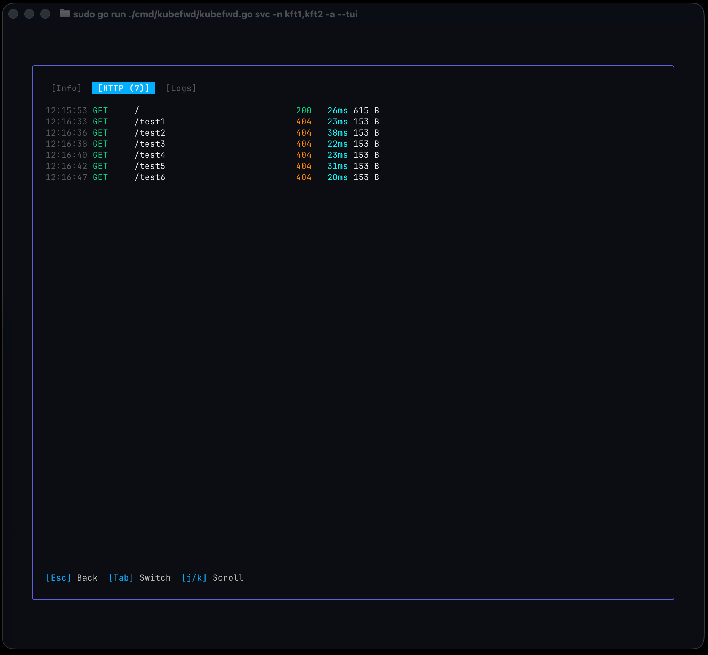
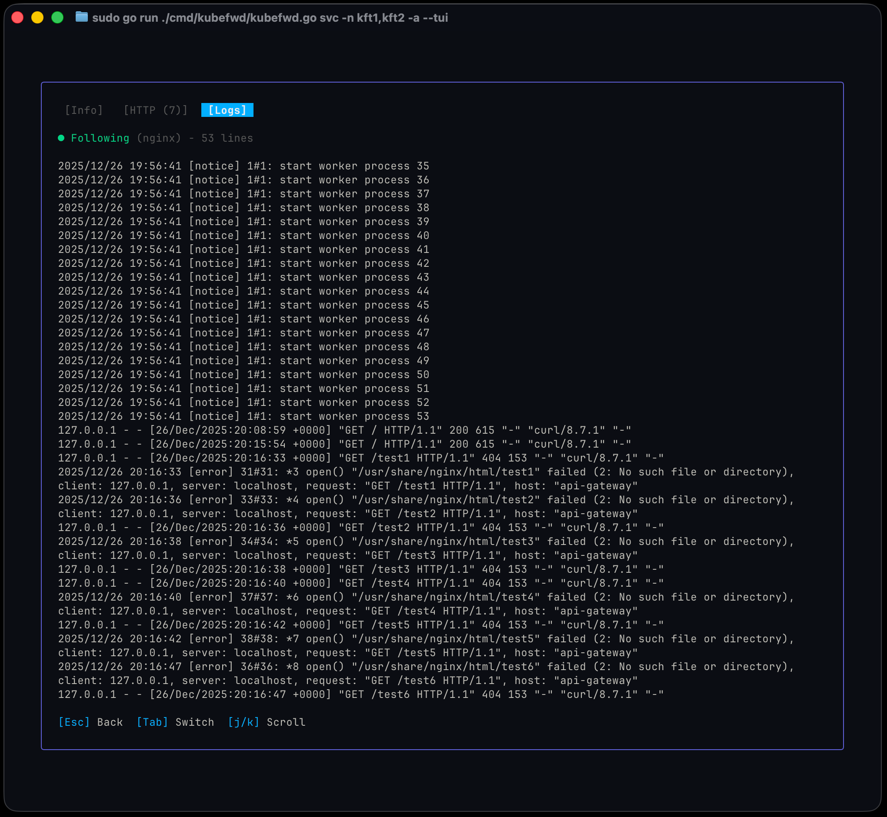

# kubefwd (Kube Forward)


[](https://github.com/txn2/kubefwd/blob/master/LICENSE)
[](https://github.com/txn2/kubefwd/actions/workflows/ci.yml)
[](https://codecov.io/gh/txn2/kubefwd)
[](https://goreportcard.com/report/github.com/txn2/kubefwd)
[](https://github.com/txn2/kubefwd/releases)
[](https://hub.docker.com/r/txn2/kubefwd)
[](https://github.com/txn2/kubefwd/releases)

## Develop Locally, Connect to Kubernetes

**kubefwd** enables developers to work on their local machine while seamlessly accessing services running in a Kubernetes cluster. If you're building a new API that needs to connect to a database at `db:5432`, an auth service at `auth:443`, and a cache at `redis:6379`, all running in your development cluster, kubefwd makes them available locally by their service names, exactly as they would appear in-cluster. No environment-specific configuration, no local service setup, no Docker Compose files. Just run `kubefwd` and your application's existing connection strings work.

This is the essential use case: **reduce or eliminate environment-specific connection setup and configurations** during local development. Your code uses `http://api-gateway:8080` in production? It works the same way on your laptop with kubefwd.

> Bulk Kubernetes port forwarding with an interactive TUI, unique IPs per service, and automatic reconnection.

**kubefwd** is a command-line utility that bulk port forwards Kubernetes services to your local workstation. Each service gets its own unique loopback IP (127.x.x.x), eliminating port conflicts and enabling realistic local development with cluster services accessible by name.


## Quick Start

```bash
# Install (macOS)
brew install txn2/tap/kubefwd

# Forward all services in a namespace with the interactive TUI
sudo -E kubefwd svc -n my-namespace --tui
```

Press `?` for help, `q` to quit. See [Getting Started](docs/getting-started.md) for detailed installation and setup.

## How It Works

<div align="center">
  
</div>

kubefwd discovers services in your namespace, assigns each a unique loopback IP, updates `/etc/hosts` with service names, and establishes port forwards through the Kubernetes API. Access services by name just like in-cluster:

```bash
curl http://api-service:8080
mysql -h database -P 3306
redis-cli -h cache -p 6379
```

See [Architecture](docs/architecture.md) for technical details on IP allocation, SPDY connections, and the TUI design.

## Features

- **Interactive TUI** - Real-time service monitoring with traffic metrics and sparkline graphs
- **Unique IP per Service** - Each service gets its own 127.x.x.x address, eliminating port conflicts
- **Auto-Reconnect** - Automatically reconnects when pods restart or connections drop
- **Bulk Forwarding** - Forward all services in a namespace (or multiple namespaces) with a single command
- **Live Traffic Monitoring** - See bytes in/out and HTTP request activity
- **Pod Log Streaming** - View container logs directly in the TUI
- **Headless Service Support** - Forwards all pods for headless services

See [Advanced Usage](docs/advanced-usage.md) for multi-namespace, Docker, and headless service details. See [Comparison](docs/comparison.md) for how kubefwd compares to Telepresence, mirrord, and other tools.

## TUI Screenshots

### Main View - Services Connecting

The main view shows a services table at the top with columns for hostname, port, namespace, status, and traffic metrics (Total In/Out, Rate In/Out). Services display "Connecting" (yellow) while establishing port forwards. The logs panel at the bottom shows real-time kubefwd activity. The status bar displays forward count, errors, and aggregate throughput.



### Main View - Help Overlay

Press `?` to toggle the help overlay showing all keyboard shortcuts. Navigation keys (j/k, g/G, PgUp/PgDn), actions (Enter for detail, r to reconnect, / to filter), display toggles (b for bandwidth, c for compact), and detail view controls (1-9 to copy, h for HTTP). Mouse wheel scrolls and Shift+drag selects text.



### Service Detail - Connection Info

Press Enter on any service to open the detail view. The Info tab displays numbered connect strings (press 1-9 to copy), the backing pod name with connection duration, and bandwidth sparklines showing traffic over time. Multiple hostname variations are provided for flexibility (short name, FQDN, namespace-qualified).



### Service Detail - HTTP Activity

The HTTP tab captures HTTP requests flowing through the port forward, showing timestamp, method, path, status code, response time, and payload size. Green 200s indicate successful requests; orange 404s show not-found responses. Use j/k to scroll through request history.



### Service Detail - Pod Logs

The Logs tab streams live container logs from the forwarded pod. This example shows nginx worker processes starting and HTTP access logs with request details. The "Following" indicator shows the container name and line count. Scrolling up with k or mouse wheel pauses auto-follow; scroll to bottom to resume.



## Why kubefwd?

Unlike `kubectl port-forward`, kubefwd:

| Feature | kubectl port-forward | kubefwd |
|---------|---------------------|---------|
| Services per command | One | All in namespace |
| IP allocation | localhost only | Unique IP per service |
| Port conflicts | Manual management | None (unique IPs) |
| Service name resolution | Not supported | Automatic (/etc/hosts) |
| Auto-reconnect | No | Yes |
| Real-time monitoring | No | TUI with metrics |

See [Comparison](docs/comparison.md) for detailed comparisons with Telepresence, mirrord, Gefyra, and other tools.

## Installation

### macOS

```bash
brew install txn2/tap/kubefwd
```

### Linux

Download from [releases](https://github.com/txn2/kubefwd/releases):
- `.deb` for Debian/Ubuntu
- `.rpm` for RHEL/CentOS/Fedora
- `.tar.gz` for any Linux

### Windows

```batch
scoop install kubefwd
```

### Docker

```bash
docker run -it --rm --privileged \
  -v "$HOME/.kube:/root/.kube:ro" \
  txn2/kubefwd services -n my-namespace --tui
```

See [Advanced Usage](docs/advanced-usage.md#docker-integration) for Docker Compose examples and [Getting Started](docs/getting-started.md) for complete installation instructions.

## Verifying Downloads

All release artifacts are signed using [Cosign](https://github.com/sigstore/cosign) keyless signing with GitHub Actions OIDC.

### Verify Checksums

```bash
# Download the checksum file and signature bundle
curl -LO https://github.com/txn2/kubefwd/releases/latest/download/kubefwd_checksums.txt
curl -LO https://github.com/txn2/kubefwd/releases/latest/download/kubefwd_checksums.txt.sigstore.json

# Verify signature
cosign verify-blob \
  --bundle kubefwd_checksums.txt.sigstore.json \
  --certificate-identity-regexp="https://github.com/txn2/kubefwd/.*" \
  --certificate-oidc-issuer="https://token.actions.githubusercontent.com" \
  kubefwd_checksums.txt
```

### Verify Docker Images

```bash
cosign verify txn2/kubefwd:latest \
  --certificate-oidc-issuer="https://token.actions.githubusercontent.com" \
  --certificate-identity-regexp="https://github.com/txn2/kubefwd/.*"
```

## Usage

### Interactive Mode (Recommended)

```bash
sudo -E kubefwd svc -n default --tui
```

### Classic Mode

```bash
sudo -E kubefwd svc -n default
```

### Common Options

```bash
# Multiple namespaces
sudo -E kubefwd svc -n default,staging,production --tui

# All namespaces
sudo -E kubefwd svc -A --tui

# Filter by label
sudo -E kubefwd svc -n default -l app=api --tui

# Set-based label selectors
sudo -E kubefwd svc -n default -l "app in (api,web,worker)" --tui

# Single service by name
sudo -E kubefwd svc -n default -f metadata.name=my-service --tui

# Port mapping (service:local)
sudo -E kubefwd svc -n default -m 80:8080 --tui
```

For comprehensive selector examples, see [Advanced Usage](docs/advanced-usage.md#selectors).

## Demo Environment

A comprehensive demo manifest is included for testing and demonstrations:

```bash
# Deploy demo services (60 services across 2 namespaces)
kubectl apply -f test/manifests/demo-microservices.yaml

# Forward all demo services
sudo -E kubefwd svc -n kft1,kft2 --tui

# Cleanup
kubectl delete -f test/manifests/demo-microservices.yaml
```

See [test/manifests/demo-microservices.yaml](test/manifests/demo-microservices.yaml) for advanced label selection examples.

## Documentation

- [Getting Started](docs/getting-started.md) - Installation and first steps
- [TUI Guide](docs/tui-guide.md) - Interactive interface and keyboard shortcuts
- [Configuration](docs/configuration.md) - All command line options
- [Advanced Usage](docs/advanced-usage.md) - Multi-cluster, selectors, Docker
- [Troubleshooting](docs/troubleshooting.md) - Common issues and solutions
- [Architecture](docs/architecture.md) - How kubefwd works
- [Comparison](docs/comparison.md) - kubefwd vs Telepresence, mirrord, Gefyra

## Keyboard Shortcuts

| Key | Action |
|-----|--------|
| `?` | Help |
| `q` | Quit |
| `Tab` | Switch panels |
| `Enter` | Open service detail |
| `/` | Filter services |
| `r` | Reconnect errored services |
| `j/k` | Navigate up/down |

See [TUI Guide](docs/tui-guide.md) for all shortcuts, traffic monitoring, and pod log streaming.

## Requirements

- kubectl configured with cluster access
- Root/sudo access (for /etc/hosts and network interfaces)

## Contributing

We welcome contributions for bug fixes, tests, and documentation. See [CONTRIBUTING.md](CONTRIBUTING.md).

**Note:** Feature development is limited to maintainers at this time.

## Why TUI?

The TUI (Terminal User Interface) provides a far more ergonomic experience: see all forwarded services and their connection state at a glance, identify errored forwards immediately, monitor bandwidth rates and totals, and quickly view pod logs for the exact container servicing each port forward—all without leaving the terminal or juggling multiple kubectl commands.

The `--tui` flag is explicit rather than default because kubefwd is over 7 years old with many developers relying on it in established workflows and scripts. We didn't want to impose a new interface on existing users. The TUI is also new, and like any significant feature, we need time to work out edge cases across different platforms and terminal environments. In future versions, we plan to make TUI the default with a `--no-tui` flag for those who prefer the classic output.

## License

[Apache License 2.0](LICENSE)

---

## Sponsor

Open source project by [Craig Johnston](https://twitter.com/cjimti), sponsored by [Deasil Works, Inc.](https://deasil.works/)

Follow [@cjimti](https://twitter.com/cjimti) on X for project updates.
