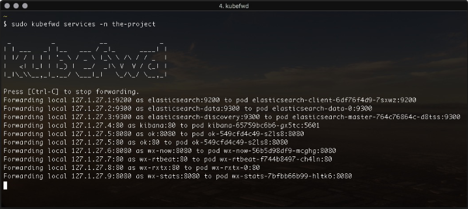

# kubefwd

**kubefwd** is a command line utility built to port forward some or all pods within a [Kubernetes] [namespace]. **kubefwd** uses the same port exposed by the service and forwards it from a loopback ip address on your local workstation. **kubefwd** temporally adds domain entries to your `/etc/hosts` file with the service names it forwards.

When working on our local workstation, my team and I often build applications that access services by their service names and ports within a Kubernetes namespace. **kubefwd** allows us to develop locally with services available as they would be in the cluster.



## Install / Update

**kubefwd** assumes you have **kubectl** installed and configured with access to a Kubernetes cluster. **kubefwd** uses the **kubectl** current context.

Ensure you have a context by running:
```bash
kubectl config current-context
```

If you are running MacOS and use [homebrew] you can install **kubefwd** directly from the [txn2] tap:

```bash
brew install txn2/tap/kubefwd
```

To upgrade:
```bash
brew upgrade kubefwd
```

Checkout the [releases](https://github.com/txn2/kubefwd/releases) section on Github for alternative binaries or [Fork kubefwd](https://github.com/txn2/kubefwd) and build your own version. I welcome any useful pull requests.

## Help

```bash
$ kubefwd services --help

 _          _           __             _
| | ___   _| |__   ___ / _|_      ____| |
| |/ / | | | '_ \ / _ \ |_\ \ /\ / / _  |
|   <| |_| | |_) |  __/  _|\ V  V / (_| |
|_|\_\\__,_|_.__/ \___|_|   \_/\_/ \__,_|

Forward all Kubernetes services.

Usage:
  kubefwd services [flags]

Aliases:
  services, svcs, svc

Flags:
  -h, --help                help for services
  -c, --kubeconfig string   absolute path to the kubeconfig file (default "/Users/cjimti/.kube/config")
  -n, --namespace string    Specify a namespace.
  -l, --selector string     Selector (label query) to filter on, supports '=', '==', and '!='.(e.g. -l key1=value1,key2=value2)
```

## Development

Build test release:
```bash
goreleaser --skip-publish --rm-dist --skip-validate
```

Build and release:
```bash
GITHUB_TOKEN=$GITHUB_TOKEN goreleaser --rm-dist
```

[Kubernetes]:https://kubernetes.io/
[namespace]:https://kubernetes.io/docs/concepts/overview/working-with-objects/namespaces/
[homebrew]:https://brew.sh/
[txn2]:https://txn2.com/