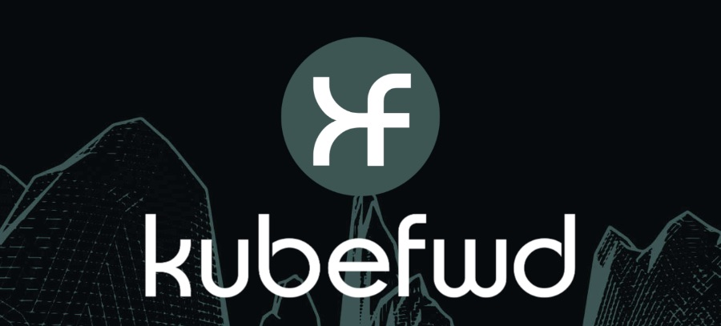

# kubefwd (Kube Forward)



[](https://landscape.cncf.io/?item=app-definition-and-development--application-definition-image-build--kubefwd)
[](https://github.com/txn2/kubefwd/blob/master/LICENSE)
[](https://codecov.io/gh/txn2/kubefwd)
[](https://goreportcard.com/report/github.com/txn2/kubefwd)
[](https://github.com/txn2/kubefwd/releases)
[](https://github.com/txn2/kubefwd/releases)
[](https://scorecard.dev/viewer/?uri=github.com/txn2/kubefwd)
[](https://www.bestpractices.dev/projects/11659)
[](https://slsa.dev)


**[Documentation](https://kubefwd.com)** | **[Getting Started](https://kubefwd.com/getting-started/)** | **[User Guide](https://kubefwd.com/user-guide/)** | **[API Reference](https://kubefwd.com/api-reference/)** | **[MCP (AI Integration)](https://kubefwd.com/mcp-integration/)**

## Develop Locally, Connect to Kubernetes

**kubefwd** enables developers to work on their local machine while seamlessly accessing services running in a Kubernetes cluster. If you're building a new API that needs to connect to a database at `db:5432`, an auth service at `auth:443`, and a cache at `redis:6379`, all running in your development cluster, kubefwd makes them available locally by their service names, exactly as they would appear in-cluster. No environment-specific configuration, no local service setup, no Docker Compose files. Just run `kubefwd` and your application's existing connection strings work.

This is the essential use case: **reduce or eliminate environment-specific connection setup and configurations** during local development. Your code uses `http://api-gateway:8080` in production? It works the same way on your laptop with kubefwd.

> Bulk Kubernetes port forwarding with an interactive TUI, unique IPs per service, and automatic reconnection.

**kubefwd** is a command-line utility that bulk port forwards Kubernetes services to your local workstation. Each service gets its own unique loopback IP (127.x.x.x), eliminating port conflicts and enabling realistic local development with cluster services accessible by name.


## Quick Start

```bash
# Install (macOS)
brew install kubefwd

# Forward all services in a namespace with the interactive TUI
sudo -E kubefwd svc -n my-namespace --tui
```

Press `?` for help, `q` to quit. See [Getting Started](https://kubefwd.com/getting-started/) for detailed installation and setup.

## How It Works

<div align="center">
  
</div>

kubefwd discovers services in your namespace, assigns each a unique loopback IP, updates `/etc/hosts` with service names, and establishes port forwards through the Kubernetes API. Access services by name just like in-cluster:

```bash
curl http://api-service:8080
mysql -h database -P 3306
redis-cli -h cache -p 6379
```

## Features

- **Interactive TUI**: Real-time service monitoring with traffic metrics
- **Unique IP per Service**: Each service gets its own 127.x.x.x address
- **Auto-Reconnect**: Reconnects when pods restart or connections drop
- **Bulk Forwarding**: Forward all services in a namespace with one command
- **Live Traffic Monitoring**: See bytes in/out and HTTP activity
- **Pod Log Streaming**: View container logs in the TUI
- **REST API**: Programmatic control via HTTP endpoints
- **MCP Support**: Integration with AI assistants (Claude Code, Cursor)

## Installation

**macOS:**
```bash
brew install kubefwd
```

**Linux:** Download `.deb`, `.rpm`, or `.tar.gz` from [releases](https://github.com/txn2/kubefwd/releases)

**Windows:**
```powershell
winget install txn2.kubefwd
# or
scoop install kubefwd
```

**Docker:**
```bash
docker run -it --rm --privileged \
  -v "$HOME/.kube:/root/.kube:ro" \
  txn2/kubefwd services -n my-namespace --tui
```

## Usage

```bash
# Interactive mode (recommended)
sudo -E kubefwd svc -n default --tui

# Multiple namespaces
sudo -E kubefwd svc -n default,staging --tui

# Filter by label
sudo -E kubefwd svc -n default -l app=api --tui

# With REST API enabled
sudo -E kubefwd svc -n default --tui --api
```

## Why kubefwd?

Unlike `kubectl port-forward`, kubefwd:

| Feature | kubectl port-forward | kubefwd |
|---------|---------------------|---------|
| Services per command | One | All in namespace |
| IP allocation | localhost only | Unique IP per service |
| Port conflicts | Manual management | None (unique IPs) |
| Service name resolution | Not supported | Automatic (/etc/hosts) |
| Auto-reconnect | No | Yes |
| Real-time monitoring | No | TUI with metrics |

See [Comparison](https://kubefwd.com/comparison/) for detailed comparisons with Telepresence, mirrord, and other tools.

## Documentation

Full documentation at **[kubefwd.com](https://kubefwd.com)**:

- [Getting Started](https://kubefwd.com/getting-started/) - Installation and setup
- [User Guide](https://kubefwd.com/user-guide/) - Interface and shortcuts
- [Configuration](https://kubefwd.com/configuration/) - CLI options
- [Advanced Usage](https://kubefwd.com/advanced-usage/) - Multi-cluster, selectors
- [REST API](https://kubefwd.com/api-reference/) - API reference
- [MCP Integration](https://kubefwd.com/mcp-integration/) - AI assistant setup
- [Troubleshooting](https://kubefwd.com/troubleshooting/) - Common issues
- [Architecture](https://kubefwd.com/architecture/) - Technical details
- [Comparison](https://kubefwd.com/comparison/) - vs Telepresence, mirrord

## Requirements

- kubectl configured with cluster access
- Root/sudo access (for /etc/hosts and network interfaces)

## Contributing

We welcome contributions for bug fixes, tests, and documentation. Feature development is limited to maintainers. See [CONTRIBUTING.md](CONTRIBUTING.md).

## License

[Apache License 2.0](LICENSE)

---

Open source by [Craig Johnston](https://twitter.com/cjimti), sponsored by [Deasil Works, Inc.](https://deasil.works/)
