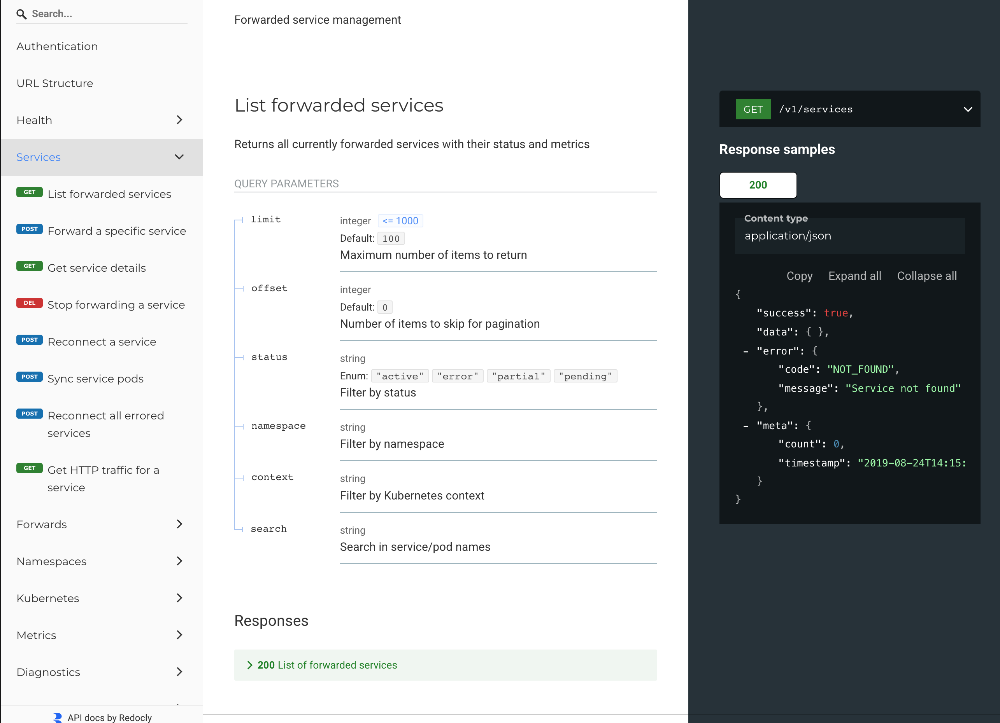

# REST API

kubefwd's REST API enables programmatic control over port forwarding. Build custom tooling, integrate with CI/CD pipelines, or create dashboards that dynamically manage which services are forwarded. Add and remove namespaces or individual services on the fly, query real-time metrics, stream events via SSE, and diagnose connection issues without restarting kubefwd.

## Quick Start

```bash
# Idle mode - API enabled by default, add namespaces dynamically
sudo -E kubefwd

# Or forward a namespace with API enabled
sudo -E kubefwd svc -n default --api

# Test the API
curl http://kubefwd.internal/api/health
```

The API is available at `http://kubefwd.internal/api`. 

Interactive documentation is at `http://kubefwd.internal/docs`.



## Overview

| Property | Value |
|----------|-------|
| Base URL | `http://kubefwd.internal/api` |
| Authentication | None (loopback only) |
| Response Format | JSON |
| OpenAPI Spec | `/openapi.yaml` |

All responses use this wrapper format:

```json
{
  "success": true,
  "data": { ... },
  "error": null
}
```

Error responses:

```json
{
  "success": false,
  "data": null,
  "error": {
    "code": "NOT_FOUND",
    "message": "Service not found"
  }
}
```

---

## Health & Info

### GET /api/health

Health check endpoint.

```bash
curl http://kubefwd.internal/api/health
```

```json
{
  "status": "healthy",
  "timestamp": "2025-01-15T10:30:00Z"
}
```

### GET /api/info

Server information and version.

```bash
curl http://kubefwd.internal/api/info
```

```json
{
  "version": "1.26.0",
  "uptime": "2h15m30s",
  "startedAt": "2025-01-15T08:15:00Z"
}
```

---

## Services

### GET /api/v1/services

List all forwarded services.

**Query Parameters:**

| Parameter | Type | Description |
|-----------|------|-------------|
| namespace | string | Filter by namespace |
| context | string | Filter by context |
| status | string | Filter by status (active, error) |

```bash
# List all services
curl http://kubefwd.internal/api/v1/services

# Filter by namespace
curl http://kubefwd.internal/api/v1/services?namespace=default
```

### GET /api/v1/services/:key

Get a specific service. Key format: `service-name.namespace.context`

```bash
curl http://kubefwd.internal/api/v1/services/api-gateway.default.minikube
```

### POST /api/v1/services

Add a new service to forward.

```bash
curl -X POST http://kubefwd.internal/api/v1/services \
  -H "Content-Type: application/json" \
  -d '{
    "namespace": "default",
    "service_name": "my-service",
    "context": "minikube"
  }'
```

### DELETE /api/v1/services/:key

Stop forwarding a service.

```bash
curl -X DELETE http://kubefwd.internal/api/v1/services/my-service.default.minikube
```

### POST /api/v1/services/:key/reconnect

Reconnect a specific service.

```bash
curl -X POST http://kubefwd.internal/api/v1/services/api-gateway.default.minikube/reconnect
```

### POST /api/v1/services/:key/sync

Sync service with Kubernetes (refresh pods).

```bash
curl -X POST http://kubefwd.internal/api/v1/services/api-gateway.default.minikube/sync
```

### POST /api/v1/services/reconnect

Reconnect all services (or all errored services).

```bash
# Reconnect all errored services
curl -X POST http://kubefwd.internal/api/v1/services/reconnect

# Force reconnect all services
curl -X POST "http://kubefwd.internal/api/v1/services/reconnect?force=true"
```

---

## Forwards

Individual port forwards (a service may have multiple forwards for different pods/ports).

### GET /api/v1/forwards

List all active port forwards.

**Query Parameters:**

| Parameter | Type | Description |
|-----------|------|-------------|
| namespace | string | Filter by namespace |
| service | string | Filter by service name |
| status | string | Filter by status |

```bash
curl http://kubefwd.internal/api/v1/forwards
```

### GET /api/v1/forwards/:key

Get details for a specific forward.

```bash
curl http://kubefwd.internal/api/v1/forwards/api-gateway-pod-abc.default.minikube
```

### GET /api/v1/forwards/:key/http

Get HTTP traffic captured for a forward.

**Query Parameters:**

| Parameter | Type | Description |
|-----------|------|-------------|
| count | integer | Number of entries (default: 50) |

```bash
curl http://kubefwd.internal/api/v1/forwards/api-gateway.default.minikube/http?count=10
```

---

## Namespaces

Manage namespace watchers dynamically.

### GET /api/v1/namespaces

List active namespace watchers.

```bash
curl http://kubefwd.internal/api/v1/namespaces
```

### GET /api/v1/namespaces/:key

Get details for a namespace watcher. Key format: `namespace.context`

```bash
curl http://kubefwd.internal/api/v1/namespaces/default.minikube
```

### POST /api/v1/namespaces

Add a namespace watcher (start forwarding all services in namespace).

```bash
curl -X POST http://kubefwd.internal/api/v1/namespaces \
  -H "Content-Type: application/json" \
  -d '{
    "namespace": "staging",
    "context": "minikube"
  }'
```

### DELETE /api/v1/namespaces/:key

Remove a namespace watcher (stop forwarding all services in namespace).

```bash
curl -X DELETE http://kubefwd.internal/api/v1/namespaces/staging.minikube
```

---

## Kubernetes Discovery

Query the Kubernetes cluster for available resources.

### GET /api/v1/kubernetes/contexts

List available kubeconfig contexts.

```bash
curl http://kubefwd.internal/api/v1/kubernetes/contexts
```

### GET /api/v1/kubernetes/namespaces

List namespaces in a context.

**Query Parameters:**

| Parameter | Type | Description |
|-----------|------|-------------|
| context | string | Kubernetes context (uses current if omitted) |

```bash
curl http://kubefwd.internal/api/v1/kubernetes/namespaces?context=minikube
```

### GET /api/v1/kubernetes/services

List services in a namespace.

**Query Parameters:**

| Parameter | Type | Description |
|-----------|------|-------------|
| namespace | string | Namespace (required) |
| context | string | Kubernetes context |

```bash
curl "http://kubefwd.internal/api/v1/kubernetes/services?namespace=default&context=minikube"
```

### GET /api/v1/kubernetes/services/:namespace/:name

Get details for a specific Kubernetes service.

```bash
curl http://kubefwd.internal/api/v1/kubernetes/services/default/api-gateway
```

### GET /api/v1/kubernetes/pods/:namespace

List pods in a namespace with status, ready state, restarts, and age.

**Query Parameters:**

| Parameter | Type | Description |
|-----------|------|-------------|
| context | string | Kubernetes context (uses current if omitted) |
| labelSelector | string | Filter pods by labels (e.g., "app=nginx") |
| serviceName | string | Filter to pods backing this service |

```bash
# List all pods in namespace
curl http://kubefwd.internal/api/v1/kubernetes/pods/default

# Filter by label
curl "http://kubefwd.internal/api/v1/kubernetes/pods/default?labelSelector=app=nginx"

# Filter by service
curl "http://kubefwd.internal/api/v1/kubernetes/pods/default?serviceName=api-gateway"
```

### GET /api/v1/kubernetes/pods/:namespace/:podName

Get detailed pod information including containers, status, conditions, and resources.

```bash
curl http://kubefwd.internal/api/v1/kubernetes/pods/default/api-gateway-7d4f5b6c8-abc12
```

### GET /api/v1/kubernetes/pods/:namespace/:podName/logs

Get logs from a pod's container.

**Query Parameters:**

| Parameter | Type | Description |
|-----------|------|-------------|
| context | string | Kubernetes context (uses current if omitted) |
| container | string | Container name (defaults to first container) |
| tailLines | integer | Lines from end (default: 100, max: 1000) |
| sinceTime | string | RFC3339 timestamp to start from |
| previous | boolean | Get logs from previous container instance |
| timestamps | boolean | Include timestamps in output |

```bash
# Get last 100 lines
curl http://kubefwd.internal/api/v1/kubernetes/pods/default/api-gateway-7d4f5b6c8-abc12/logs

# Get last 50 lines with timestamps
curl "http://kubefwd.internal/api/v1/kubernetes/pods/default/api-gateway-7d4f5b6c8-abc12/logs?tailLines=50&timestamps=true"

# Get logs from specific container
curl "http://kubefwd.internal/api/v1/kubernetes/pods/default/api-gateway-7d4f5b6c8-abc12/logs?container=sidecar"
```

### GET /api/v1/kubernetes/events/:namespace

Get Kubernetes events for debugging. Shows scheduling, pulling, starting, and killing events.

**Query Parameters:**

| Parameter | Type | Description |
|-----------|------|-------------|
| context | string | Kubernetes context (uses current if omitted) |
| resourceKind | string | Filter by kind (Pod, Service, Deployment) |
| resourceName | string | Filter by resource name |
| limit | integer | Max events to return (default: 50) |

```bash
# Get all events in namespace
curl http://kubefwd.internal/api/v1/kubernetes/events/default

# Filter to pod events
curl "http://kubefwd.internal/api/v1/kubernetes/events/default?resourceKind=Pod"

# Get events for specific pod
curl "http://kubefwd.internal/api/v1/kubernetes/events/default?resourceKind=Pod&resourceName=api-gateway-7d4f5b6c8-abc12"
```

### GET /api/v1/kubernetes/endpoints/:namespace/:serviceName

Get endpoints for a service. Shows which pods are backing the service and their ready state.

```bash
curl http://kubefwd.internal/api/v1/kubernetes/endpoints/default/api-gateway
```

---

## Metrics

Traffic and performance metrics.

### GET /api/v1/metrics

Summary metrics for all forwards.

```bash
curl http://kubefwd.internal/api/v1/metrics
```

```json
{
  "totalServices": 15,
  "activeForwards": 23,
  "totalBytesIn": 1048576,
  "totalBytesOut": 524288,
  "uptime": "2h15m"
}
```

### GET /api/v1/metrics/services

Metrics grouped by service.

```bash
curl http://kubefwd.internal/api/v1/metrics/services
```

### GET /api/v1/metrics/services/:key

Detailed metrics for a specific service.

```bash
curl http://kubefwd.internal/api/v1/metrics/services/api-gateway.default.minikube
```

### GET /api/v1/metrics/services/:key/history

Historical metrics for a service (time series data).

**Query Parameters:**

| Parameter | Type | Description |
|-----------|------|-------------|
| duration | string | Time window (e.g., "1h", "30m") |
| interval | string | Bucket interval (e.g., "1m", "5m") |

```bash
curl "http://kubefwd.internal/api/v1/metrics/services/api-gateway.default.minikube/history?duration=1h"
```

---

## Diagnostics

Error analysis and troubleshooting.

### GET /api/v1/diagnostics

Diagnostics summary.

```bash
curl http://kubefwd.internal/api/v1/diagnostics
```

### GET /api/v1/diagnostics/errors

List current errors.

```bash
curl http://kubefwd.internal/api/v1/diagnostics/errors
```

### GET /api/v1/diagnostics/services/:key

Diagnostics for a specific service.

```bash
curl http://kubefwd.internal/api/v1/diagnostics/services/api-gateway.default.minikube
```

### GET /api/v1/diagnostics/forwards/:key

Diagnostics for a specific forward.

```bash
curl http://kubefwd.internal/api/v1/diagnostics/forwards/api-gateway.default.minikube
```

### GET /api/v1/diagnostics/network

Network interface diagnostics.

```bash
curl http://kubefwd.internal/api/v1/diagnostics/network
```

---

## Analysis

AI-friendly status and analysis endpoints.

### GET /api/v1/status

Quick status overview optimized for AI tools.

```bash
curl http://kubefwd.internal/api/v1/status
```

```json
{
  "status": "healthy",
  "message": "All services forwarding normally",
  "totalServices": 15,
  "activeServices": 15,
  "errorCount": 0
}
```

### GET /api/v1/analyze

Detailed analysis with recommendations.

```bash
curl http://kubefwd.internal/api/v1/analyze
```

---

## History

Event and error history.

### GET /api/v1/history/events

Recent events.

**Query Parameters:**

| Parameter | Type | Description |
|-----------|------|-------------|
| count | integer | Number of events (default: 50) |

```bash
curl http://kubefwd.internal/api/v1/history/events?count=20
```

### GET /api/v1/history/errors

Error history.

```bash
curl http://kubefwd.internal/api/v1/history/errors?count=20
```

### GET /api/v1/history/reconnections

All reconnection events.

```bash
curl http://kubefwd.internal/api/v1/history/reconnections
```

### GET /api/v1/services/:key/history/reconnections

Reconnection history for a specific service.

```bash
curl http://kubefwd.internal/api/v1/services/api-gateway.default.minikube/history/reconnections
```

### GET /api/v1/history/stats

Aggregated history statistics.

```bash
curl http://kubefwd.internal/api/v1/history/stats
```

---

## Logs

Application logs.

### GET /api/v1/logs

Recent log entries.

**Query Parameters:**

| Parameter | Type | Description |
|-----------|------|-------------|
| count | integer | Number of entries (default: 100) |
| level | string | Filter by level (debug, info, warn, error) |
| service | string | Filter by service |

```bash
curl "http://kubefwd.internal/api/v1/logs?count=50&level=error"
```

### GET /api/v1/logs/stream

Server-Sent Events (SSE) stream of logs.

```bash
curl http://kubefwd.internal/api/v1/logs/stream
```

### GET /api/v1/logs/system

System-level logs.

```bash
curl http://kubefwd.internal/api/v1/logs/system
```

### DELETE /api/v1/logs/system

Clear system logs.

```bash
curl -X DELETE http://kubefwd.internal/api/v1/logs/system
```

---

## Events (SSE)

### GET /api/v1/events

Server-Sent Events stream for real-time updates.

```bash
curl http://kubefwd.internal/api/v1/events
```

Event types:

- `service.added` - New service started forwarding
- `service.removed` - Service stopped forwarding
- `service.error` - Service encountered an error
- `forward.connected` - Port forward established
- `forward.disconnected` - Port forward lost
- `pod.added` - Pod added to service
- `pod.removed` - Pod removed from service

Example event:

```
event: service.added
data: {"key":"api-gateway.default.minikube","namespace":"default","service":"api-gateway"}
```

---

## HTTP Traffic

HTTP request/response capture for debugging.

### GET /api/v1/services/:key/http

HTTP traffic for a service.

**Query Parameters:**

| Parameter | Type | Description |
|-----------|------|-------------|
| count | integer | Number of entries (default: 50) |

```bash
curl http://kubefwd.internal/api/v1/services/api-gateway.default.minikube/http?count=10
```

---

## Error Codes

| Code | Description |
|------|-------------|
| `NOT_FOUND` | Resource not found |
| `BAD_REQUEST` | Invalid request parameters |
| `INTERNAL_ERROR` | Server error |
| `ALREADY_EXISTS` | Resource already exists |
| `CONFLICT` | Operation conflicts with current state |

---

## See Also

- [Getting Started](getting-started.md) - Installation and basic usage
- [MCP Integration](mcp-integration.md) - AI assistant integration
- [Configuration](configuration.md) - CLI flags reference
