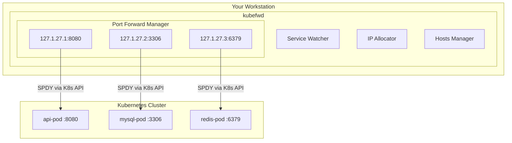
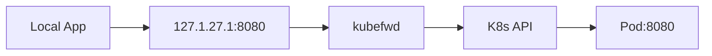
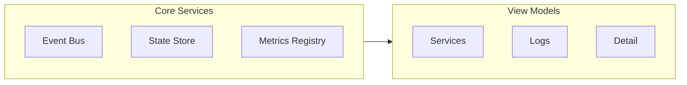

# Architecture

How kubefwd works under the hood.

## Overview

kubefwd establishes port forwards to Kubernetes services by:

1. Discovering services in specified namespaces
2. Allocating unique local IP addresses (127.x.x.x)
3. Updating `/etc/hosts` with service hostnames
4. Creating SPDY connections through the Kubernetes API
5. Monitoring pod lifecycle for automatic reconnection



## Key Components

### Service Discovery

kubefwd uses Kubernetes **informers** to watch for service events:

- **Add**: New service discovered → start port forward
- **Update**: Service modified → update port forward if needed
- **Delete**: Service removed → stop port forward, cleanup hosts

This event-driven approach means kubefwd reacts in real-time to cluster changes.

### IP Allocation

Each service receives a unique loopback IP address:

```
127.[1+cluster].[27+namespace].[service_count]
```

| Component | Base | Range |
|-----------|------|-------|
| First octet | 127 | Fixed |
| Second octet | 1 | 1-255 (cluster index) |
| Third octet | 27 | 27-255 (namespace index) |
| Fourth octet | 1 | 1-255 (service count) |

**Why unique IPs?**

Unlike `kubectl port-forward` which uses `localhost:port`, kubefwd assigns each service its own IP. This allows:

- Multiple services on the same port (e.g., several databases on 3306)
- Realistic service topology matching in-cluster behavior
- No port conflict management needed

### Hosts File Management

kubefwd modifies `/etc/hosts` to map service names to allocated IPs:

```
# Before kubefwd
127.0.0.1       localhost

# After kubefwd starts
127.0.0.1       localhost
127.1.27.1      api-service
127.1.27.2      database
127.1.27.3      cache
```

**Safety measures:**
- Original hosts file backed up to `~/hosts.original`
- Entries removed on clean shutdown
- Mutex locking prevents race conditions
- Stale entry purging available (`-p` flag)

### Port Forwarding

kubefwd creates SPDY connections through the Kubernetes API server:

1. **Pod Selection**: Find pods backing the service
2. **Connection**: Establish SPDY tunnel via API server
3. **Local Binding**: Bind to allocated IP and service port(s)
4. **Data Transfer**: Proxy traffic bidirectionally



### Pod Lifecycle Monitoring

kubefwd watches pod events to maintain forwarding:

- **Pod deleted**: Stop forward, trigger reconnection
- **Pod recreated**: Auto-reconnect (if enabled)
- **Pod crash**: Detect via connection loss, reconnect

The auto-reconnect feature uses exponential backoff:
- Initial: 1 second
- Maximum: 5 minutes
- Reset on successful connection

## Service Types

### Normal Services (ClusterIP)

For services with selectors:

1. Query pods matching the selector
2. Select first available Running pod
3. Forward to that single pod
4. Hostname: `service-name`

### Headless Services (ClusterIP: None)

For services without cluster IP:

1. Query all pods matching the selector
2. Forward to ALL pods
3. Hostnames:
   - `service-name` → first pod
   - `pod-name.service-name` → each specific pod

This is essential for StatefulSets and databases requiring pod-specific addressing.

### Services Without Selectors

**Not supported.** kubefwd requires pod selectors to discover backing pods. Services with manually managed Endpoints are skipped.

## TUI Architecture

The Terminal User Interface uses the [Bubble Tea](https://github.com/charmbracelet/bubbletea) framework:



### Event Bus

Decoupled communication between components:
- Service status changes
- Metrics updates
- Log messages
- User actions

### State Store

Centralized, thread-safe state management:
- Forward status for all services
- Metrics data (bytes, rates)
- Filter/sort state

### Metrics Collection

Traffic monitoring with:
- Byte counters (atomic operations)
- Rate calculations (rolling window)
- HTTP request/response detection
- Sparkline visualization

## Thread Safety

kubefwd handles concurrent operations carefully:

| Resource | Protection |
|----------|------------|
| Service registry | RWMutex |
| IP allocation | Per-namespace mutex |
| Hosts file | Global mutex with file locking |
| Metrics | Atomic operations + RWMutex |
| Event bus | Channel-based with buffer |

## Shutdown Sequence

Clean shutdown ensures no leftover state:

1. User signal (q, Ctrl+C) → stop listening
2. Close service watchers
3. Stop all port forwards
4. Remove hosts file entries
5. Remove network interface aliases

If shutdown is interrupted, use `-p` to purge stale entries on next run.

## Network Interface Management

kubefwd creates loopback aliases:

**macOS (lo0):**
```bash
ifconfig lo0 alias 127.1.27.1
```

**Linux (lo):**
```bash
ip addr add 127.1.27.1/8 dev lo
```

These aliases allow binding to unique IPs while keeping traffic local.

## Security Considerations

kubefwd requires elevated privileges for:

1. **Network interface modification**: Adding IP aliases
2. **Hosts file modification**: DNS resolution
3. **Low port binding**: Ports below 1024

**Recommendations:**
- Run only in development environments
- Don't run in production workstations with sensitive data
- Review services before forwarding from production clusters
- Use label selectors to limit scope

## Performance Characteristics

| Operation | Complexity |
|-----------|------------|
| Service discovery | O(services) per namespace |
| Port forward setup | O(1) per service |
| Metrics sampling | O(forwards) per second |
| Hosts file update | O(forwards) per change |

kubefwd is designed for development use with dozens to hundreds of services. For very large clusters, use selectors to limit scope.
