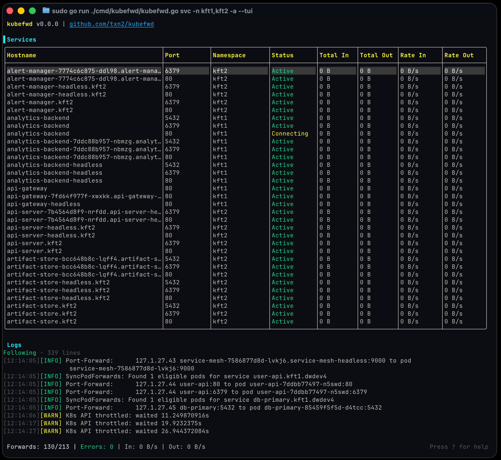

<div class="home-hero">
  
  
</div>

<div class="home-intro">
  <p><strong>kubefwd</strong> enables developers to work locally while accessing services running in Kubernetes. Connect to <code>db:5432</code>, <code>auth:443</code>, <code>redis:6379</code>—all by service name, exactly as in-cluster. No environment config, no Docker Compose. Just run kubefwd.</p>
</div>

<div class="home-buttons">
  <a href="getting-started/" class="btn btn-primary">Get Started</a>
  <a href="https://github.com/txn2/kubefwd" class="btn btn-secondary">GitHub</a>
</div>

<div class="home-screenshot">
  
</div>

<div class="home-modes" markdown>

## Four Ways to Use kubefwd

=== "Idle Mode"

    Start without pre-specified services. Browse and forward interactively.

    ```bash
    sudo -E kubefwd --tui
    ```

    - Browse namespaces and services visually
    - Forward exactly what you need
    - API and auto-reconnect enabled by default
    - [Getting Started →](getting-started.md)

=== "Classic Mode"

    Forward all services in a namespace immediately.

    ```bash
    sudo -E kubefwd svc -n my-namespace --tui
    ```

    - Backwards-compatible with all previous versions
    - Perfect for known workflows
    - [Getting Started →](getting-started.md)

=== "REST API"

    Programmatic control via 40+ HTTP endpoints.

    ```bash
    sudo -E kubefwd  # Idle mode, API enabled
    curl http://kubefwd.internal/api/v1/services
    ```

    - Add/remove namespaces and services dynamically
    - Query metrics and diagnostics
    - SSE event streaming
    - [REST API →](api-reference.md)

=== "MCP"

    Talk to your AI about your work, not about tools.

    ```bash
    # Add to Claude Code
    claude mcp add --transport stdio kubefwd -- kubefwd mcp
    ```

    - "Connect me to the staging database"
    - "Test my new API deployment"
    - "Why can't my app reach redis?"
    - [MCP Integration →](mcp-integration.md)

</div>

<div class="home-features">
  <div class="feature">
    <span class="feature-icon">🔌</span>
    <div>
      <strong>Unique IP per Service</strong>
      <span>Each service gets its own 127.x.x.x. Multiple databases on port 3306? No conflicts.</span>
    </div>
  </div>
  <div class="feature">
    <span class="feature-icon">🔄</span>
    <div>
      <strong>Auto-Reconnect</strong>
      <span>Pods restart? kubefwd reconnects automatically with exponential backoff.</span>
    </div>
  </div>
  <div class="feature">
    <span class="feature-icon">📊</span>
    <div>
      <strong>Interactive TUI</strong>
      <span>Browse namespaces, select services, monitor traffic, and stream logs.</span>
    </div>
  </div>
  <div class="feature">
    <span class="feature-icon">🌐</span>
    <div>
      <strong>Service Names Work</strong>
      <span>Updates /etc/hosts so any app can access services by name.</span>
    </div>
  </div>
</div>

<div class="home-install">

```bash
# macOS
brew install kubefwd

# Windows
winget install txn2.kubefwd

# Then start exploring
sudo -E kubefwd --tui
```

</div>

<div class="home-footer">
  <a href="https://landscape.cncf.io/?item=app-definition-and-development--application-definition-image-build--kubefwd"></a>
  <a href="https://github.com/txn2/kubefwd/releases"></a>
  <a href="https://github.com/txn2/kubefwd"></a>
  <p>Open source by <a href="https://twitter.com/cjimti">Craig Johnston</a></p>
</div>
