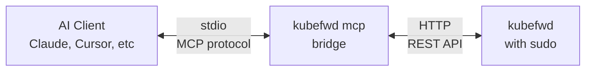

# MCP Integration

## What is MCP?

The **Model Context Protocol (MCP)** is an open standard that lets AI assistants connect to external tools and services. Instead of just answering questions, your AI can actually *do things*: forward ports, query databases, run commands, and interact with APIs.

kubefwd's MCP integration gives your AI assistant full access to Kubernetes port forwarding capabilities. Your AI can discover services, establish connections, monitor traffic, stream logs, and troubleshoot issues, all through natural conversation.

**Supported AI Platforms:**

| Platform | Support |
|----------|---------|
| **Claude** (Desktop & Code) | Full support |
| **ChatGPT** | Full support |
| **Cursor** | Full support |
| **Windsurf** | Full support |
| **VS Code Copilot** | Full support |
| **Gemini** | Full support |
| **Zed** | Preview |
| **Cline** | Full support |
| **JetBrains IDEs** | Planned |

---

## Why MCP?

Don't ask about kubefwd. Ask about your work.

Need a database connection? Say "I need to connect to PostgreSQL in staging." Your AI handles the infrastructure. Want to test a deployment? Say "Test my new API and show me the logs." kubefwd becomes invisible.

## What It Looks Like

### Accessing Cluster Services

> **You:** "I need to connect to PostgreSQL in kft1 on the dev cluster"
>
> **AI:** "Connected. Use: `psql -h postgres -U admin -d mydb`"

Behind the scenes, the AI discovered the service, forwarded it, and got your connection info. You just asked for what you needed.

### Setting Up Your Environment

> **You:** "I'm starting work on the checkout service, set up my environment"
>
> **AI:** "Your environment is ready. These services are available locally:
>
> - cart-service:8080
> - payment-service:443
> - inventory-service:8080
> - user-db:5432
>
> Add to your .env:
> ```
> CART_URL=http://cart-service:8080
> PAYMENT_URL=https://payment-service:443
> ```"

### Testing Your Deployment

> **You:** "I just deployed my payments API to staging. Test it and show me the traffic."
>
> **AI:** "I forwarded payments-api from staging. Results:
>
> - GET /health returned 200 OK (45ms)
> - Service receiving 12 req/sec
> - No errors in last 5 minutes
> - Pod logs: 'Server started on :8080'"

### Debugging Issues

> **You:** "My API calls to auth-service are failing with connection refused"
>
> **AI:** "The auth-service pod restarted and the forward was stale. I've reconnected it. Try again."

Or:

> **You:** "My new user-service deployment isn't working"
>
> **AI:** "I tested user-service:
>
> - /health returns 503 Service Unavailable
> - Pod logs: 'ERROR: Cannot connect to database'
>
> The postgres service isn't in this namespace. Did you mean to deploy to staging where postgres exists?"

### Service Discovery

> **You:** "What databases are available in the dev cluster?"
>
> **AI:** "I found:
>
> - PostgreSQL in default and staging namespaces
> - MySQL in the legacy namespace
> - Redis in default and production
>
> Which do you need?"

---

## Setup

### 1. Start kubefwd

```bash
sudo -E kubefwd  # Idle mode, API enabled
```

### 2. Configure Your AI

=== "Claude Desktop (One-Click)"

    Download the `.mcpb` bundle for your platform from [GitHub Releases](https://github.com/txn2/kubefwd/releases):

    - **macOS (Apple Silicon):** `kubefwd-VERSION-darwin-arm64.mcpb`
    - **macOS (Intel):** `kubefwd-VERSION-darwin-amd64.mcpb`
    - **Windows:** `kubefwd-VERSION-windows-amd64.mcpb`

    Double-click the downloaded file to install kubefwd as a Claude Desktop extension.

=== "Claude Code (Easy)"

    One command to add kubefwd:

    ```bash
    claude mcp add --transport stdio kubefwd -- kubefwd mcp
    ```

    Verify it's configured:

    ```bash
    claude mcp list
    ```

=== "Claude Code (Manual)"

    Add to `~/.claude.json`:

    ```json
    {
      "mcpServers": {
        "kubefwd": {
          "command": "kubefwd",
          "args": ["mcp"]
        }
      }
    }
    ```

=== "Cursor"

    Add to `~/.cursor/mcp.json` (global) or `.cursor/mcp.json` (project):

    ```json
    {
      "mcpServers": {
        "kubefwd": {
          "command": "kubefwd",
          "args": ["mcp"]
        }
      }
    }
    ```

=== "Windsurf"

    Open Windsurf, click the hammer (MCP) icon in Cascade sidebar, then Configure:

    ```json
    {
      "mcpServers": {
        "kubefwd": {
          "command": "kubefwd",
          "args": ["mcp"]
        }
      }
    }
    ```

=== "ChatGPT"

    In ChatGPT settings, add a custom MCP connector pointing to kubefwd.
    See [OpenAI MCP docs](https://platform.openai.com/docs/guides/tools-connectors-mcp) for details.

=== "VS Code Copilot"

    Add to your VS Code settings or `.vscode/mcp.json`:

    ```json
    {
      "mcpServers": {
        "kubefwd": {
          "command": "kubefwd",
          "args": ["mcp"]
        }
      }
    }
    ```

=== "Cline"

    In Cline settings (VS Code extension), add MCP server:

    ```json
    {
      "mcpServers": {
        "kubefwd": {
          "command": "kubefwd",
          "args": ["mcp"]
        }
      }
    }
    ```

That's it. Start talking to your AI about your work.

---

## What Your AI Can Do

### Service Forwarding

- **Forward entire namespaces** - Forward all services in a namespace to localhost with automatic `/etc/hosts` entries
- **Forward individual services** - Forward specific services with custom port mappings
- **Remove forwards** - Stop forwarding namespaces or individual services

### Discovery & Connection

- **List Kubernetes contexts** - See available clusters from your kubeconfig
- **List namespaces** - Discover what namespaces are available and which are forwarded
- **List services** - See services in a namespace with their types, ports, and selectors
- **Get connection info** - Get ready-to-use connection strings, IPs, hostnames, and environment variables
- **Find services** - Search forwarded services by name pattern, port, or namespace

### Pod Debugging

- **List pods** - See pods with status, ready state, restarts, and age; filter by labels or service
- **Get pod details** - Inspect containers, conditions, resources, and recent events
- **Get pod logs** - Stream logs from containers with tail, timestamps, and time filtering
- **Get Kubernetes events** - View scheduling, pulling, starting events for diagnosing failures
- **Get service endpoints** - See which pods back a service and their ready state

### Monitoring & Debugging

- **Quick status** - Fast health check of kubefwd (healthy/degraded/unhealthy)
- **View logs** - Filter by level (debug, info, warn, error) or search terms
- **Get metrics** - Bandwidth stats, bytes in/out, transfer rates, per-service breakdown
- **HTTP traffic** - View requests flowing through forwards (method, path, status code, response time)
- **Event history** - Track events, errors, and reconnections over time

### Troubleshooting

- **Diagnose errors** - Root cause analysis with specific fix suggestions
- **Get analysis** - Full issue classification with priorities and recommended actions
- **Reconnect services** - Force reconnection for errored or stale services
- **Sync services** - Re-discover pods after deployments or pod restarts

---

## Architecture



The MCP bridge runs without sudo and communicates with kubefwd via REST API. Your AI spawns it automatically.

---

## Technical Reference

For custom integrations, kubefwd MCP provides:

??? note "28 Tools"

    | Category | Tools |
    |----------|-------|
    | Discovery | `list_k8s_namespaces`, `list_k8s_services`, `list_contexts` |
    | Namespace | `add_namespace`, `remove_namespace` |
    | Service | `add_service`, `remove_service`, `list_services`, `get_service`, `find_services` |
    | Connection | `get_connection_info`, `list_hostnames` |
    | Pods | `list_pods`, `get_pod`, `get_pod_logs` |
    | Kubernetes | `get_events`, `get_endpoints` |
    | Health | `get_health`, `get_quick_status`, `get_metrics`, `get_analysis`, `diagnose_errors` |
    | Traffic | `get_http_traffic`, `get_history`, `get_logs` |
    | Control | `reconnect_service`, `reconnect_all_errors`, `sync_service` |

??? note "8 Resources"

    | URI | Description |
    |-----|-------------|
    | `kubefwd://status` | Quick health check |
    | `kubefwd://services` | Forwarded services |
    | `kubefwd://forwards` | Port forward details |
    | `kubefwd://metrics` | Traffic metrics |
    | `kubefwd://summary` | Overall summary |
    | `kubefwd://errors` | Current errors |
    | `kubefwd://http-traffic` | HTTP requests |
    | `kubefwd://contexts` | Kubernetes contexts |

??? note "10 Prompts"

    | Prompt | Purpose |
    |--------|---------|
    | `setup_local_dev` | Environment setup guide |
    | `forward_namespace` | Forward all services |
    | `quick_connect` | Fast service connection |
    | `connection_guide` | Connection examples |
    | `troubleshoot` | Debugging workflow |
    | `debug_service` | Service-specific debug |
    | `fix_errors` | Error resolution |
    | `analyze_issues` | Issue analysis |
    | `explain_status` | Status explanation |
    | `monitor` | Monitoring guide |

---

## See Also

- [REST API](api-reference.md) - Direct API access for custom tooling
- [Getting Started](getting-started.md) - Installation and basic usage
