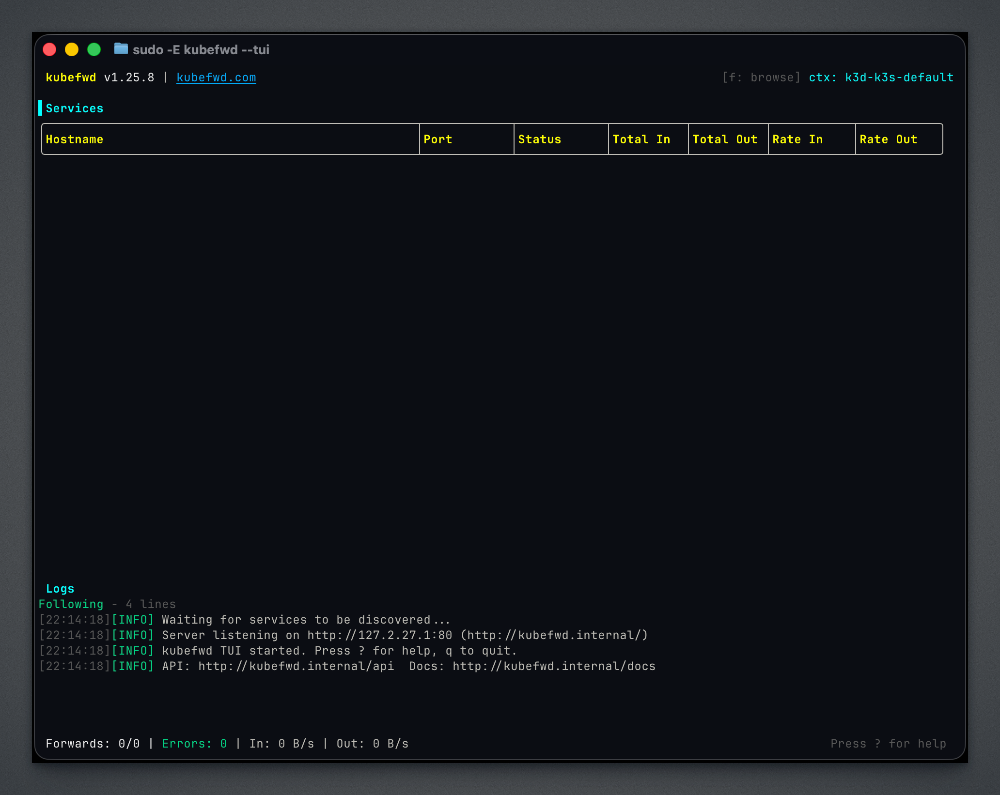
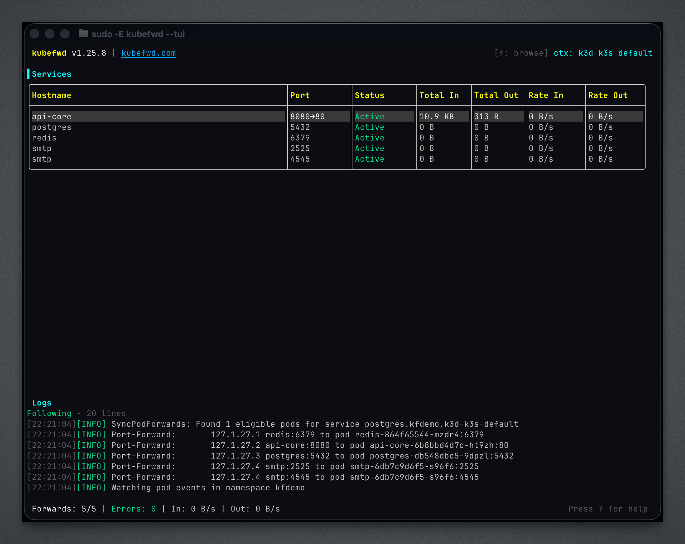
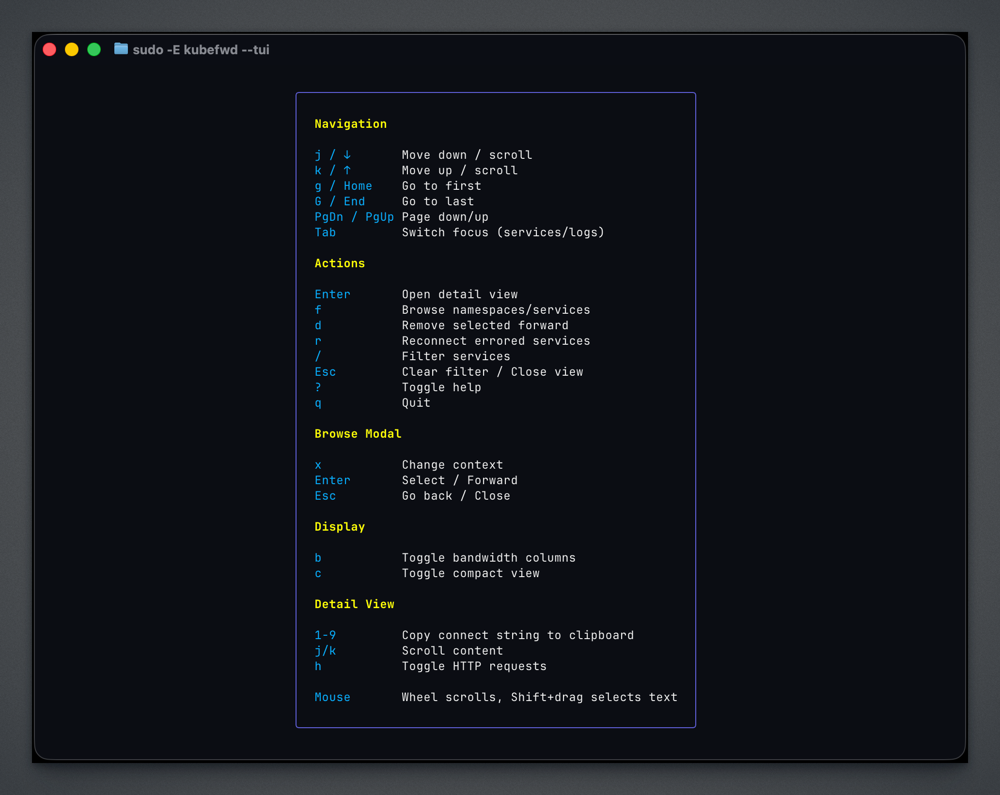
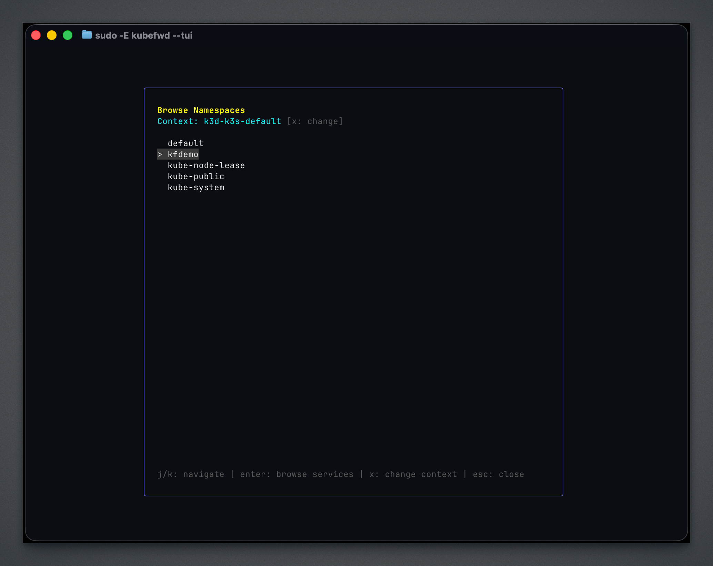
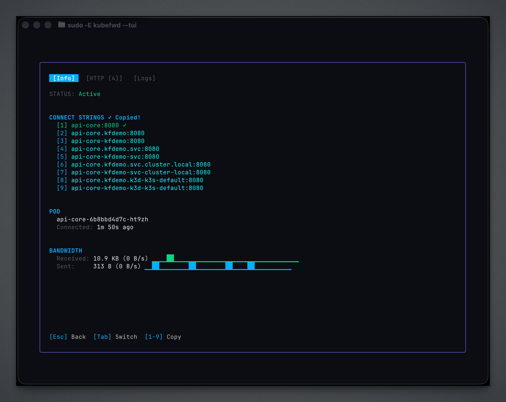
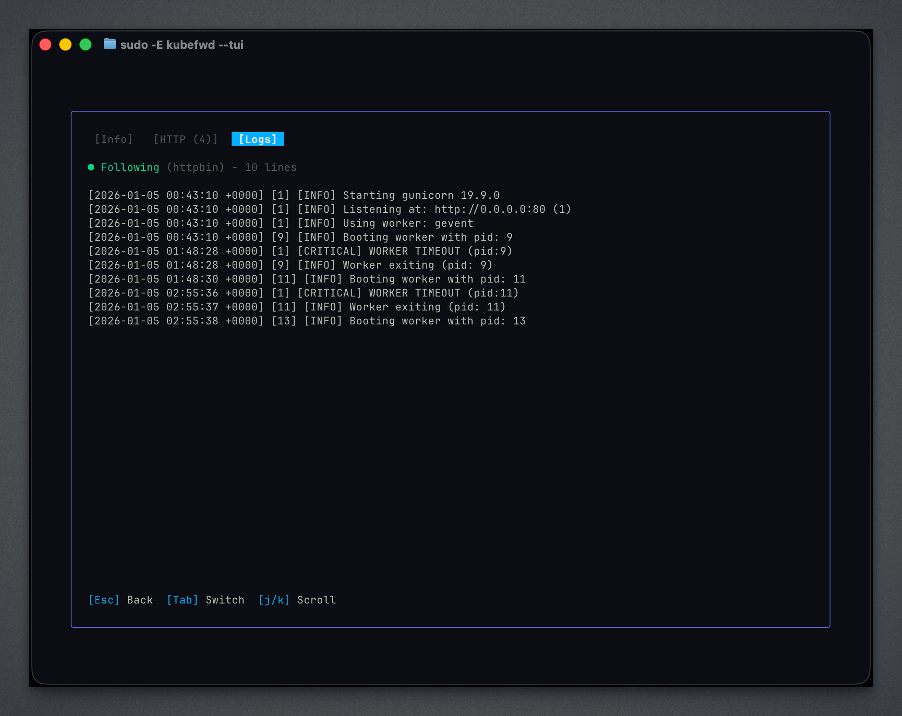

# User Guide

The Terminal User Interface (TUI) transforms kubefwd into an interactive development companion. Browse namespaces, select services, monitor traffic, and stream logs—all from your terminal.

---

## Launching kubefwd

### Idle Mode (Recommended)

Start without pre-specified services and add them interactively:

```bash
sudo -E kubefwd --tui
```



In Idle Mode, you start with an empty service list and use the built-in browsers to discover and forward services as needed. The REST API and auto-reconnect are enabled by default.

### Classic Mode

Forward all services in a namespace immediately:

```bash
sudo -E kubefwd svc -n my-namespace --tui
```

Services appear in the TUI as they're discovered and forwarded.

### Multi-Namespace

Forward from multiple namespaces:

```bash
sudo -E kubefwd svc -n frontend,backend,data --tui
```

---

## Interface Overview

The TUI consists of several panels that provide different views of your forwarded services.

### Main View



The main view shows:

| Panel | Description |
|-------|-------------|
| **Services** | All forwarded services with status, namespace, local address, and traffic |
| **Logs** | Real-time kubefwd activity, connection events, and errors |
| **Status Bar** | Service counts, current filter, and keyboard hints |

### Service Status Indicators

| Indicator | Meaning |
|-----------|---------|
| Green dot | Active and forwarding |
| Yellow dot | Connecting or reconnecting |
| Red dot | Error state |

### Help Overlay

Press `?` to see all available keyboard shortcuts:



---

## Namespace Browser

Press `f` to open the namespace browser. This modal lets you explore your cluster and select what to forward.



### Navigation

| Key | Action |
|-----|--------|
| `j` / `↓` | Move down |
| `k` / `↑` | Move up |
| `Enter` | Select namespace and open service browser |
| `Esc` | Close browser |

Namespaces already being forwarded are marked.

---

## Service Browser

After selecting a namespace, the service browser shows available services:


### Actions

| Key | Action |
|-----|--------|
| `j` / `↓` | Move down |
| `k` / `↑` | Move up |
| `Space` | Toggle selection for current service |
| `a` | Select all services in namespace |
| `Enter` | Forward selected services |
| `Esc` | Close without forwarding |

Services already being forwarded are marked.

---

## Context Switching

Press `x` to switch between Kubernetes contexts. After selecting a new context, press `f` to browse namespaces in that cluster.

---

## Detail View

Press `Enter` on any service to open the detail view. The detail view has three tabs.

### Info Tab

Connection details, hostnames, and traffic statistics:



**Copy connection strings:** Press `1`, `2`, or `3` to copy the corresponding connection string to your clipboard.

### Logs Tab

Live pod output streaming:



Logs stream in real-time from the pod backing the service. Use `j`/`k` to scroll through history.

### HTTP Tab

Request tracing showing traffic flowing through the forward:


The HTTP tab shows requests detected flowing through HTTP-based forwards, including method, path, response code, latency, and response size.

---

## Complete Keyboard Reference

### Global

| Key | Action |
|-----|--------|
| `q` | Quit kubefwd |
| `?` | Toggle help overlay |
| `f` | Open namespace/service browser |
| `x` | Switch Kubernetes context |
| `/` | Filter services |
| `Esc` | Clear filter / Close modal |

### Navigation

| Key | Action |
|-----|--------|
| `j` / `↓` | Move down |
| `k` / `↑` | Move up |
| `g` / `Home` | Go to first item |
| `G` / `End` | Go to last item |
| `PgDn` / `PgUp` | Page down/up |
| `Tab` | Switch focus (services ↔ logs) |

### Service Actions

| Key | Action |
|-----|--------|
| `Enter` | Open detail view for selected service |
| `d` | Remove forward for selected service |
| `r` | Reconnect all errored services |
| `R` | Force reconnect selected service |

### Display

| Key | Action |
|-----|--------|
| `b` | Toggle bandwidth columns |
| `c` | Toggle compact view |

### Detail View

| Key | Action |
|-----|--------|
| `1` - `9` | Copy connection string #N to clipboard |
| `y` | Copy first connection string |
| `Tab` / `→` | Next tab |
| `Shift+Tab` / `←` | Previous tab |
| `r` | Force reconnect this service |
| `Esc` / `q` | Close detail view |

### Browser Modals

| Key | Action |
|-----|--------|
| `j` / `k` | Navigate list |
| `Space` | Toggle selection (service browser) |
| `a` | Select all (service browser) |
| `Enter` | Confirm selection |
| `Esc` | Close modal |

---

## Auto-Reconnect

The TUI enables auto-reconnect by default. This provides dual-level reliability:

### Level 1: Kubernetes Informers

kubefwd watches pod lifecycle events. When pods:

- Restart due to crashes
- Get rescheduled to different nodes
- Are replaced during deployments

kubefwd automatically detects the change and re-establishes the forward to the new pod.

### Level 2: Connection Monitoring

For issues that don't trigger Kubernetes events:

- Network outages
- VPN reconnections
- Laptop sleep/wake cycles

kubefwd monitors TCP connections and reconnects with exponential backoff:

```
1s → 2s → 4s → 8s → 16s → 32s → 64s → 128s → 256s → 300s (max)
```

Press `r` to force immediate reconnection of all errored services.

---

## Traffic Metrics

The TUI tracks traffic for each forwarded service:

| Metric | Description |
|--------|-------------|
| **Bytes In** | Total data received from cluster |
| **Bytes Out** | Total data sent to cluster |
| **Rate** | Current transfer speed (bytes/sec) |
| **Sparkline** | Visual graph of recent activity |

Toggle bandwidth columns with `b` to save screen space.

---

## Filtering Services

Press `/` to enter filter mode:

1. Type your filter text
2. Press `Enter` to apply
3. Press `Esc` to clear

Filters match against:

- Service name
- Namespace
- Status (e.g., "error", "active")

Examples:

| Filter | Matches |
|--------|---------|
| `api` | Services containing "api" |
| `staging` | Services in namespaces containing "staging" |
| `error` | Services with connection errors |
| `postgres` | All postgres services |

---

## Mouse Support

The TUI supports mouse interaction:

- **Scroll wheel**: Navigate lists and scroll content
- **Click**: Select services
- **Shift+drag**: Select text for copying

---

## Terminal Requirements

For the best experience:

- **Colors**: Terminal with 256-color support
- **Size**: Minimum 80×24, wider is better for traffic sparklines
- **Encoding**: UTF-8 for special characters

### Recommended Terminals

| Platform | Terminals |
|----------|-----------|
| **macOS** | iTerm2, Terminal.app, Alacritty, kitty |
| **Linux** | GNOME Terminal, Konsole, Alacritty, kitty |
| **Windows** | Windows Terminal, ConEmu |

---

## Tips

1. **Start in Idle Mode**: Use `sudo -E kubefwd --tui` and add services as needed rather than forwarding everything upfront.

2. **Use the browser**: Press `f` to explore namespaces and services visually instead of remembering names.

3. **Copy connection strings**: In detail view, press `1`-`9` to copy ready-to-use connection commands.

4. **Watch the logs panel**: Issues often appear in logs before they affect your work.

5. **Filter early**: Use `/` to focus on services you're actively debugging.

6. **Wide terminals**: More room means better traffic sparklines and service details.

7. **Context switching**: Press `x` to work with multiple clusters without restarting kubefwd.
